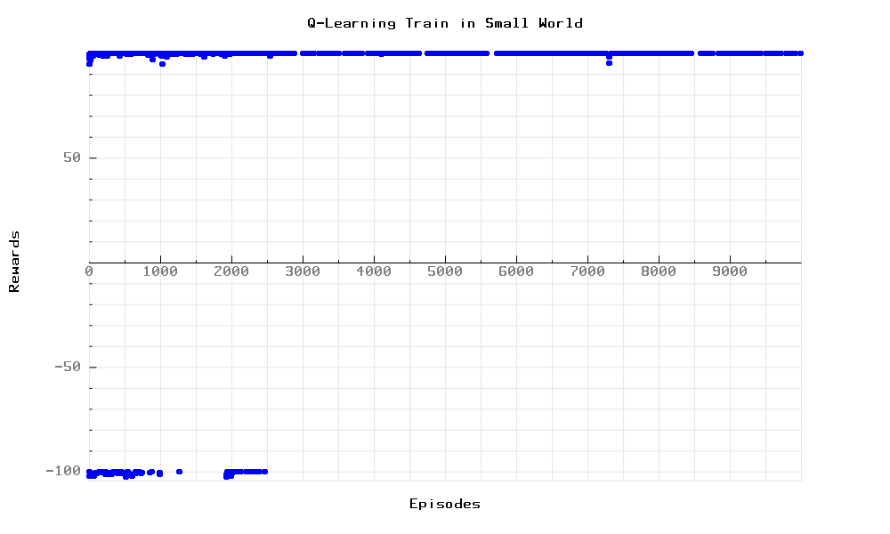
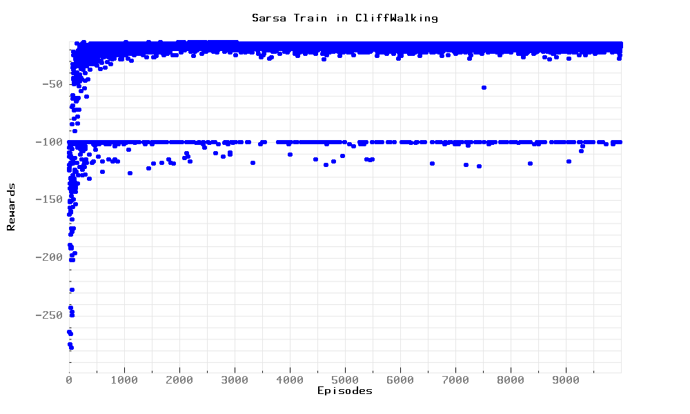

#  **Reinforcement Learning** 

Sarsa and Q-Learning in C++

## **Usage:**
* Modify params in `main.cpp`
* Compile with `g++ *.cpp -std=c++11 -g`
* Run `./a.out`

## **Thanks:**
* [@InductiveComputerScience](https://github.com/InductiveComputerScience/pbPlots) for [pbPlots](https://github.com/InductiveComputerScience/pbPlots)

